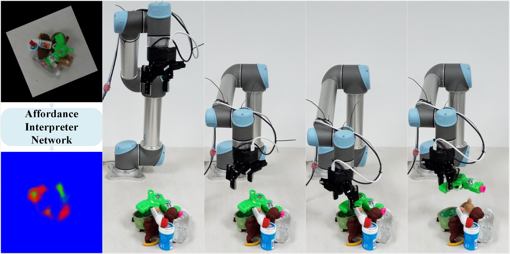
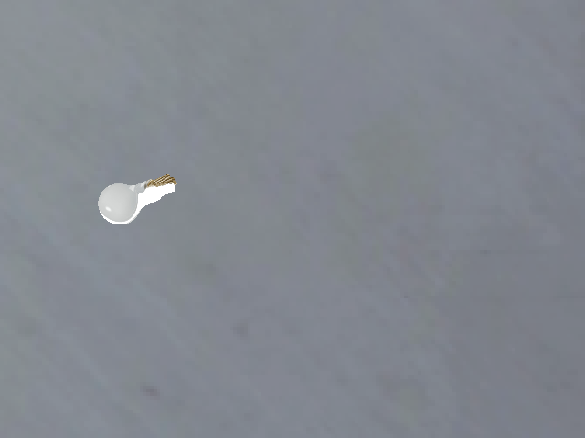
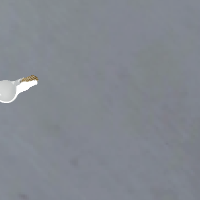
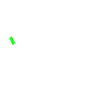
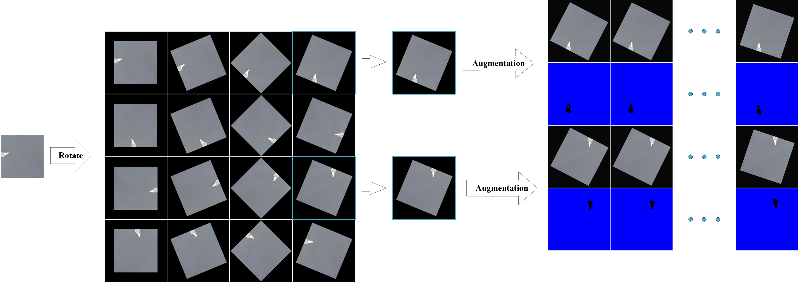

# MetaGrasp: Data Efficient Grasping by Affordance Interpreter Network
 This repository is the code for the paper
**[MetaGrasp: Data Efficient Grasping by Affordance Interpreter Network](https://sysu-robotics-lab.github.io/MetaGrasp/)**

[Junhao Cai](None)<sup>1</sup>
[Hui Cheng](http://sdcs.sysu.edu.cn/content/2504)<sup>1</sup>
[Zhangpeng Zhang](https://zhzhanp.github.io/)<sup>2</sup>
[Jingcheng Su](None)<sup>1</sup>

 <sup>1</sup>Sun Yat-sen University
 <sup>2</sup>Sensetime Group Limited
 
 Accepted at International Conference on Robotics and Automation 2019 (ICRA2019) .
 
 <div align="center">
    
 </div>
 <center> Fig.1. The grasp system pipeline.</center>
 
 ### MetaGrasp: Data Efficient Grasping by Affordance Interpreter Network
 **Abstract** Data-driven approach for grasping shows significant advance recently. 
 But these approaches usually require much training data. To increase the efficiency 
 of grasping data collection, this paper presents a novel grasp training system 
 including the whole pipeline from data collection to model inference. The system 
 can collect effective grasp sample with a corrective strategy assisted by antipodal 
 grasp rule, and we design an affordance interpreter network to predict pixelwise 
 grasp affordance map. We define graspability, ungraspability and background as grasp 
 affordances. The key advantage of our system is that the pixel-level affordance 
 interpreter network trained with only a small number of grasp samples under antipodal 
 rule can achieve significant performance on totally unseen objects and backgrounds. 
 The training sample is only collected in simulation. Extensive qualitative and 
 quantitative experiments demonstrate the accuracy and robustness of our proposed 
 approach. In the real-world grasp experiments, we achieve a grasp success rate of 93% 
 on a set of household items and 91% on a set of adversarial items with only about 
 6,300 simulated samples. We also achieve 87% accuracy in clutter scenario. 
 Although the model is trained using only RGB image, when changing the background 
 textures, it also performs well and can achieve even 94% accuracy on the set of 
 adversarial objects, which outperforms current state-of-the-art methods.
 **Citing**
 If you find this code useful in your work, pleace consider citing:
```bash
@article{cai2019data, 
	title={Data Efficient Grasping by Affordance Interpreter Network}, 
	author={Junhao Cai, Hui Cheng, Zhanpeng Zhang, Jingcheng Su}, 
	booktitle={IEEE Conference of Robotics and Automation}, 
	year={2019} 
}
```

 **Contact**
 
 If you have any questions or fine any bugs, please contact to Junhao Cai (caijh28@mail2.sysu.edu.cn).
 #### Requirements and Dependencies
 * Python 3
* Tensorflow 1.9 or later
* Opencv 3.4.0 or later
* NVIDIA GPU with compute capability 3.5+
 #### Quick Start
 Given an RGB image containing the whole workspace, we can obtain the affordance map using our pre-trained model by:
1. Download our pre-trained model:
    ```bash
    ./download.sh
    ```
2. run the test script:
    ```bash
    python metagrasp_test.py \
    --color_dir data/test/test1.png \
    --output_dir data/output \ 
    --checkpoint_dir models/metagrasp
    ```
    The visual results are saved in the output folder.
    
#### Training
 To train new model, you should follow the steps below :
 
 **Step 1: Collect the dataset**
 You can obtain grasp dataset in V-REP using our data collecting system, 
the details can be seen in ```data_collection/README.md```.

 **Step 2: Preprocess the data**
 After the data collection, you should preprocess the data for the data converting process. Run the script:
```bash
python data_processing/data_preprocessing.py \
--data_dir data/3dnet \
--output data/training
```
Then use ```data_processing/create_tf_record.py``` to generate positive and negative tfrecords.
```bash
python data_processing/create_tf_record.py \
--data_path data/training \
--output data/tfrecords  
```
 **Step 3: Download pre-trained model**
 
 We use [Resnet](https://arxiv.org/abs/1512.03385) as initialized parameters of feature extractor of the model, 
you can have access to the pre-trained model [here](http://download.tensorflow.org/models/resnet_v1_50_2016_08_28.tar.gz).
```bash
mkdir models/checkpoints && cd models/checkpoints
wget http://download.tensorflow.org/models/resnet_v1_50_2016_08_28.tar.gz
cd ../..
```
 **Step 4: Train the model** 
 
Then you can train the model with the script ```ain_train_color.py```. 
For the basic usage the command will look something like this:
```bash
python metagrasp_train.py \
--train_log_dir models/logs_metagrasp
--dataset_dir data/tfrecords
--checkpoint_dir models/checkpoints
```
You can visualize the training results using Tensorboard by the following command:
```bash
tensorboard --logdir=models/logs_metagrasp --host=localhost --port=6666
```

#### Data format

In this section, we will first introduce the data structure of a grasp sample, 
then we will illustrate how to preprocess the sample so that we can obtain 
horizontally antipodal grasp data.

**1. Data structure**

A grasp sample consists of 
1\) the RGB image which contains the whole workspace, 
2\) the grasp point represented by image coordinates in image space, 
3\) the grasp angle, and 
4\) the grasp label with respect to the grasp point and the grasp angle. 
Note that we only assign the labels to the pixels where we do grasp trial, 
so we don't use the other regions of the grasp object when training. 
The visualization of a sample is shown as below.
<div align="center">
    
    
</div>
<center>Fig.2. Raw image captured from vision sensor.</center>

<div align="center">
    
    
    
</div>
<center>Fig.3. Cropped images and grasp label.</center>


**2. Data after preprocessing**

During the preprocessing, we first rotate the RGB image and select the rotated images 
which satisfy the horizontally antipodal grasp rule. Then we augment the data by 
slightly rotate the images and corresponding grasp angles. The whole process is shown in
Fig.4. 
<div align="center">
    
</div>
<center>Fig.4. Cropped images and grasp label.</center>


 
 
 